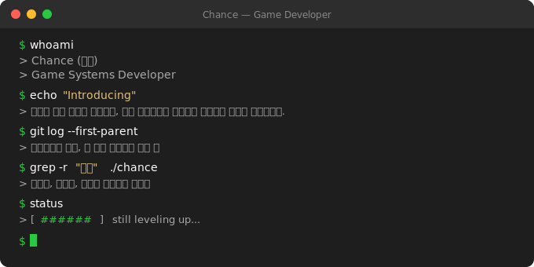

  

 

---

## Tech Stack

**Core**

**Tools**

**Experienced**

---

## Projects

> 기본기를 다지며 직접 만들어가는 프로젝트들입니다.

| 프로젝트 | 설명 | 기술 | 상태 |
|---|---|---|---|
| Console Tetris | C++로 구현하는 콘솔 테트리스 | C++ | `예정` |
| SFML Tetris | 콘솔 테트리스를 SFML로 리메이크 | C++, SFML | `예정` |

---

## GitHub Stats

 

---

## Contact

 
 

  // still leveling up, one commit at a time

