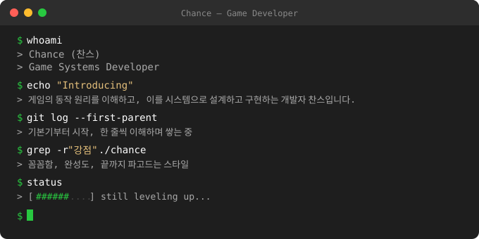

<div align="center">
  
</div>

<br/>

---

## What I Learned

> AI를 활용하되, 코드를 이해하고 판단하는 능력을 함께 키우는 방식으로 공부하고 있습니다.

- 객체 간 책임을 분리하며 구조를 설계하는 방식과, 입력·업데이트·렌더링 흐름을 나누어 관리하는 게임 루프 구성을 익혔습니다.
- SFML을 도입하면서 외부 라이브러리 연동 방식(include/lib/dll 경로 구성, 환경변수 기반 빌드 설정)을 직접 다뤄봤습니다.
- `sf::RenderWindow`, `sf::Sprite`, `sf::Text` 등의 SFML 핵심 API를 활용해 2D 렌더링 파이프라인을 구성하고, 화면 갱신 루프를 직접 설계했습니다.
- 콘솔 기반 프로젝트를 GUI로 포팅하는 과정에서 플랫폼 레이어 분리의 중요성과, 로직과 표현을 분리한 아키텍처의 장점을 체감했습니다.

---

## Tech Stack

**Core**

[](https://img.shields.io/badge/C++-00599C?style=flat-square&logo=cplusplus&logoColor=white)
[](https://img.shields.io/badge/Unreal_Engine-0E1128?style=flat-square&logo=unrealengine&logoColor=white)

**Tools**

[](https://img.shields.io/badge/Visual_Studio-5C2D91?style=flat-square&logo=visualstudio&logoColor=white)
[](https://img.shields.io/badge/Rider-000000?style=flat-square&logo=rider&logoColor=white)
[](https://img.shields.io/badge/Git-F05032?style=flat-square&logo=git&logoColor=white)
[](https://img.shields.io/badge/GitHub-181717?style=flat-square&logo=github&logoColor=white)
[](https://img.shields.io/badge/Notion-000000?style=flat-square&logo=notion&logoColor=white)
[](https://img.shields.io/badge/Jira-0052CC?style=flat-square&logo=jira&logoColor=white)

**Experienced**

[](https://img.shields.io/badge/C-A8B9CC?style=flat-square&logo=c&logoColor=white)
[](https://img.shields.io/badge/Python-3776AB?style=flat-square&logo=python&logoColor=white)
[](https://img.shields.io/badge/HTML5-E34F26?style=flat-square&logo=html5&logoColor=white)
[](https://img.shields.io/badge/JavaScript-F7DF1E?style=flat-square&logo=javascript&logoColor=black)

---

## Projects

> 기본기를 다지며 직접 만들어가는 프로젝트들입니다.

| 프로젝트 | 설명 | 기술 | 상태 |
|---|---|---|---|
| [Console Tetris](https://github.com/Chance031/Tetris-cpp) | C++로 구현하는 콘솔 테트리스 | C++ | v1.0.0 완료 |
| [SFML Tetris](https://github.com/Chance031/Tetris-sfml) | 콘솔 테트리스를 SFML로 리메이크 | C++, SFML | v1.0.0 완료 |
| [Tower of Omens](https://github.com/Chance031/Tower-of-Omens) | 10층 구조의 콘솔 로그라이크 RPG | C++ | 진행 중 |

---

## GitHub Stats

<div align="center">

[](https://git.io/streak-stats)

</div>

---

## Contact

```
// still leveling up, one commit at a time
```
